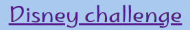
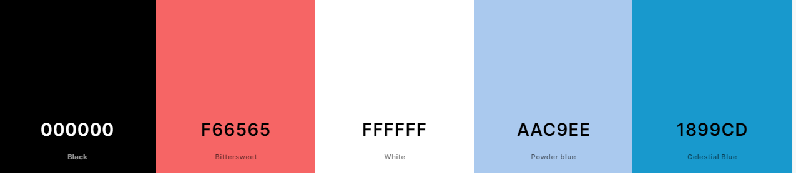
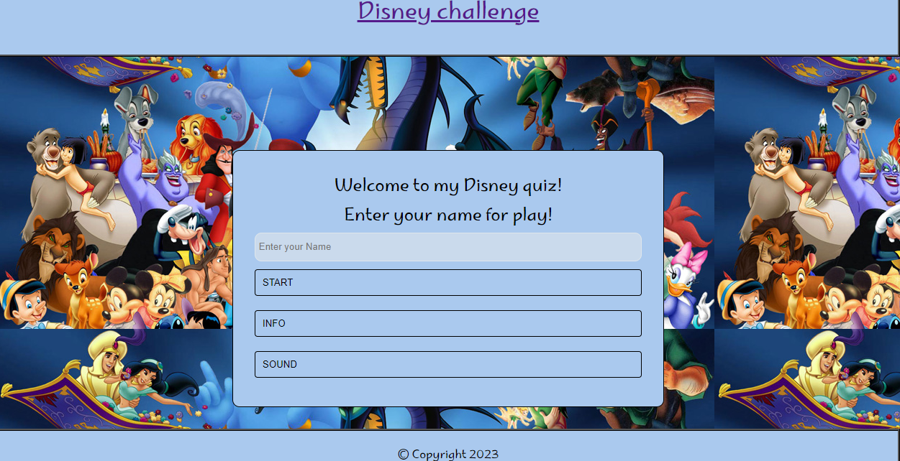
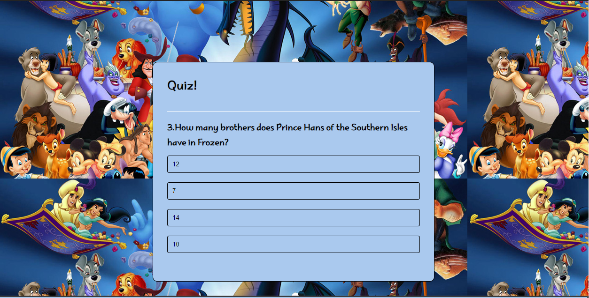
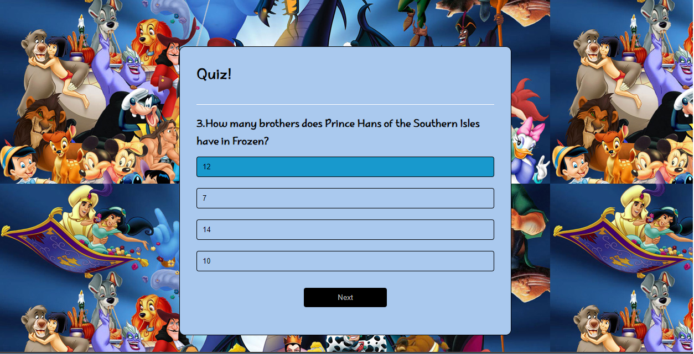
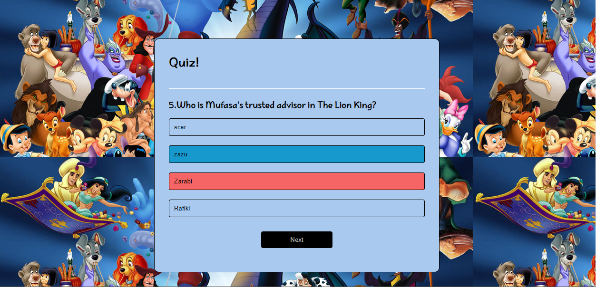
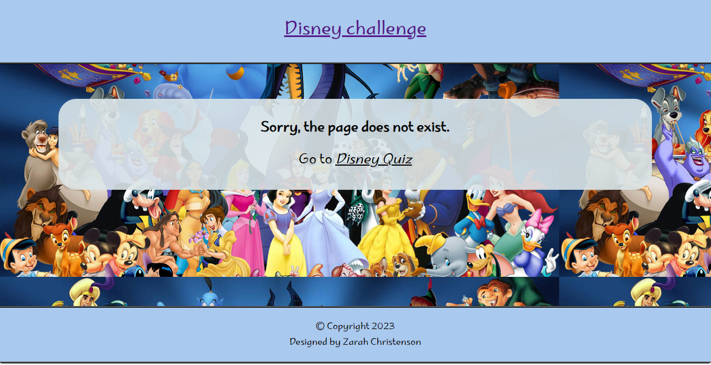

# Disney's Challenge

Visit the deployed site: [Disney¨s challenge](https://8000-zarchri-portfolio2-jkqx23rmd4c.ws-eu107.gitpod.io/index.html?name-input=Zarah+christenson)

Test your knowledge of Disney's characters and get the quiz ready!

The most of the people in the world have been raised in disneys movies and character and remember most of them. This is a quiz for 5–9 years old.

## CONTENTS

* [User Experience](#user-experience-ux)
  * [User Stories](#user-stories)

* [Design](#design)
  * [Colour Scheme](#colour-scheme)
  * [Typography](#typography)
  * [Imagery](#imagery)
  * [Wireframes](#wireframes)
  * [Features](#features)
    * [The Home Page](#the-home-page)
    * [The Game Page](#the-game-page)
    * [The High Scores Page](#the-high-scores-page)
    * [The 404 Error Page](#the-404-error-page)
    * [Future Implementations](#future-implementations)
  * [Accessibility](#accessibility)

* [Technologies Used](#technologies-used)
  * [Languages Used](#languages-used)
 

* [Deployment & Local Development](#deployment--local-development)
  * [Deployment](#deployment)
  * [Local Development](#local-development)
    * [How to Fork](#how-to-fork)
    * [How to Clone](#how-to-clone)

* [Testing](#testing)
  * [Solved Bugs](#solved-bugs)
  * [Known Bugs](#known-bugs)
  
* [Credits](#credits)
  * [Code Used](#code-used)
  * [Content](#content)
  * [Media](#media)
  * [Acknowledgments](#acknowledgments)

- - -

## User Experience (UX)

### User Stories

#### Visitor Goals

* I want to give the kids in the lower age group a fun, colorful page with the questions they can answer.
* I want the site to be responsive to different devices.
* I want the site to be easy to navigate.
* I want the page to be good for kids who are at the beginning of school and they reading.

- - -

## Design

### Colour Scheme

I wanted to have a colorful and exciting background, so the children would think it was fun, so I chose a picture with many of the known characters from Disney. 
In the quiz, I have kept it simple with the colors

In my CSS file, I have used variables to declare colors and then used these throughout the CSS file

* * I have used `#AAC9EE` & `#000000` for the background color and the color of the text.
* I have used `#1899CD` for right answer
* and #F66565 for the wrong answers.

  

### Typography

Google Fonts was used to import the chosen fonts for use on the site.

* For the Page Title I have used the google font [Marhey]('https://fonts.googleapis.com/css2?family=Lato:ital@1&family=Marhey:wght@300&family=Oswald:wght@300;400;500;600;700&family=Satisfy&display=swap'). 
I chose the type because I want a type that is very similar to the "Disney logo"

### Imagery

As the website is called Disney Challenge, I wanted to use an image for the page background of a familiar Disney character that the participant recognizes.

### Features

The website comprises a home page, a games page, an info page, and a 404 error page.

All Pages on the website are responsive and have:

* A favicon in the browser tab.

  

* The title of the site is at the top of every page. This title also acts as a link back to the home page.
  

)

#### The Home Page

The home page of The Disney Quiz displays the site name as a title and then a container that holds some welcome text, including alerting the users that they can navigate back to the home page at any time by clicking on the page name. Below this are two buttons: start and an info button

Here, the user is redirected to the info page if they first want to read about the game and how they play.

Or they can write in their name and start the game when they click on the start button, but it is required to write the name first.

The start button will redirect the user to the game page and the first question will be seen.

#### The Game Page

The game page displays the site's name as a title. This also acts as a link back to the home page. In a container,  you can see the questions.  Just click on the answer you think is correct, if it turns blue, you choose the correct answer, and if it turns light red, it is the incorrect answer. If you answer incorrectly, you will see the answer that is correct in blue. When you have an answer that is correct or incorrect, a button that stands for "next" will be shown. Push that button, and the next button will appear on the screen.

If the field the user has chosen is blue, it means it is the correct answer.

If the field is colored light-red, it is an incorrect answer, and the right answer will be blue

###end of the game and the score

When the question is finished, the user will be directed directly to the page that tells them the game is finished and what score they have reached.
There is also one button, and there it says "Play again" if the user wants to try again.

#### The 404 Error Page

The 404 error page displays the site's name as a title. This also acts as a link back to the home page. Within the page container, there is a sorry message explaining to the user that there has been an error directing them to the page they were looking for. 

#### Future Implementations

In future implementations, I would like to:

1. Give users the option to select different difficult stages.
2. more sound and picture
3. The user can choose a Disney character they want to be.
4. Add a voice who reads the question, and it would be a picture of the different options that will be easier for smaller kids to play with.

## Technologies Used

### Languages Used

HTML, CSS, Javascript

### Frameworks, Libraries & Programs Used

* [Github](https://github.com/) - To save and store the files for the website.

* [GitPod](https://gitpod.io/) - IDE used to create the site.

* [Google Fonts](https://fonts.google.com/) - To import the fonts used on the website.

* [Google Developer Tools](https://developers.google.com/web/tools) - To troubleshoot and test features, solve issues with responsiveness and styling.

* [Mowieweb](https://movieweb.com/best-disney-characters-of-all-time/) for downloaded the picture to backgroundpage

* [Youtube](https://www.youtube.com/)

* [Favicon.io](https://favicon.io/) To create favicon.

* [Am I Responsive?](http://ami.responsivedesign.is/) To show the website image on a range of devices.

* [Webpage Spell-Check](https://languagetool.org/) - A Google Chrome extension that allows you to spell-check your webpage. Used to check the site and the README for spelling errors.

- - -

## Deployment & Local Development

### Deployment

The site is deployed using GitHub Pages - [Disney Challenge](https://zarchri.github.io/portfolio2/).

To Deploy the site using GitHub Pages:

1. Login (or signup) to Github.
2. Go to the repository for this project, [zarchri/Disney challenge](https://github.com/zarchri/portfolio2).
3. Click the settings button.
4. Select pages in the left hand navigation menu.
5. From the source dropdown select main branch and press save.
6. The site has now been deployed, please note that this process may take a few minutes before the site goes live.

- - -

## Testing

Please refer to [TESTING.md](TESTING.md) file for all testing carried out.

### Solved Bugs

| No | Bug | How I solved the issue |
| :--- | :--- | :--- |
| 1 | On the score result page, it does not show the result, I only see the JavaScript code. | The problem was that I used the wrong sign-market, it worked when I changed them to right.
| 2 | It only shows 7 questions instead of 14  | The problem was that I had written dubble code in JavaScript it worked out when I deleted one of them. |
| 3 | I did not get the required field working | After guidance from tutor support, I did not get the submit button in the form, so it worked fine when I changed that |

### Known Bugs

## Credits

### Code Used

* I used [this You Tube tutorial](https://www.youtube.com/watch?v=PBcqGxrr9g8) to learn how to create a modal for the quiz section

Accept the video from YouTube. I have read about W3Schools and watched the lessons at the Code Institute.

### Content

All questions for my site were pulled from [Parade](https://parade.com/1041219/alexandra-hurtado/disney-trivia/)  .

All other content for the site, such as introduction messages and instructions, was written by myself.

### Media

[Page background image of disney character](https://movieweb.com/best-disney-characters-of-all-time/)

### Acknowledgments

I would like to acknowledge the following people:

* Jubril Akolade - My Code Institute Mentor.

* Tutor support-for helping me when I struggled in the code that often was very little simple wrong with

* The Code Institute Slack channel Peer Code Review - Thank you to everyone who help me with technically problems