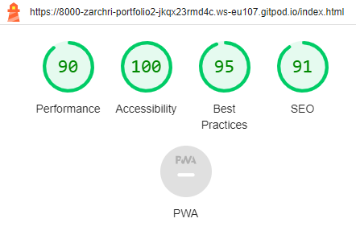
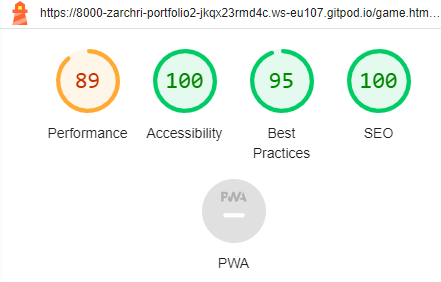
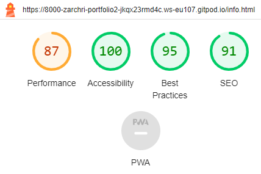
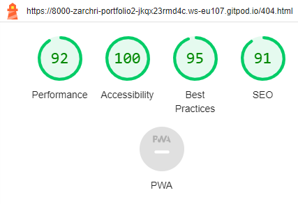

# Disney challenge -  Testing

Visit the deployed site: [Disney challenge](https://zarchri.github.io/portfolio2/)

- - -

## CONTENTS

* [AUTOMATED TESTING](#automated-testing)
  * [W3C Validator](#w3c-validator)
  * [JavaScript Validator](#javascript-validator)
  * [Lighthouse](#lighthouse)
* [MANUAL TESTING](#manual-testing)
  * [Testing User Stories](#testing-user-stories)
  * [Full Testing](#full-testing)

Testing was ongoing throughout the entire build. I utilised Chrome developer tools whilst building to pinpoint and troubleshoot any issues as I went along.

During development I made use of google developer tools to ensure everything was working correctly and to assist with troubleshooting when things were not working as expected.

I utilised the console in the developer tools to work through small sections of JavaScript and ensure that the code was working, and also to troubleshoot where issues were.

I have gone through each page using google chrome developer tools to ensure that each page is responsive on a variety of different screen sizes and devices.

- - -

## AUTOMATED TESTING

### W3C Validator

[W3C](https://validator.w3.org/) was used to validate the HTML on all pages of the website. It was also used to validate the CSS.

* [index.html](testing/w3/w3-index.png) - Passed.
* [game.html](assets/images/Skärmklipp_html%20validator_gamepage.PNG) - Passed
* [highscores.html](assets/images/Skärmklipp_html%20validator_scorepage.PNG) - Passed.
* [404.html](assets/images/skärmklipp_html%20validator_404page.PNG) - Passed.

* [style.css](testing/w3/w3-css.png) -  one parsningswrong.

- - -

### JavaScript Validator

[jshint](https://jshint.com/) was used to validate the JavaScript.

* [javascript.js](assets/images/Skärmklipp%20result_of_JShint.PNG) - Passed.

- - -

### Lighthouse

I used Lighthouse within the Chrome Developer Tools to test the performance, accessibility, best practices and SEO of the website.

All pages of the site are achieving a score of 100 in the accessibility.

### Desktop Results

### Mobile Results

- - -

## MANUAL TESTING

### Testing User Stories

`First Time Visitors`

| Goals | How are they achieved? |
| :--- | :--- |
| I want to take part in a pub quiz online and improve my general knowledge. I want to be able to play at any time, anywhere. | The Quiz Arms pulls general knowledge quiz questions from a large variety of topics, much like a pub quiz would do. The site is available for use whenever is convenient to the user. |
| I want the site to be responsive to my device. | I have developed the site with responsiveness in mind. |
| I want the site to be easy to navigate. | Buttons are used throughout the site for navigation, much like a mobile app. As the site is like a mobile app - I decided that I didn't want to add a navigation bar or footer, as these would make the site look more like a traditional webpage. The page title also acts as a link to the home page.  |

`Returning Visitors`

|  Goals | How are they achieved? |
| :--- | :--- |
| I want to be able to choose a level of difficulty that I feel is appropriate for me, based on my experience from my first visit to the site. | Users are able to select their own level of difficulty before the game begins. Once they have played they are free to select a different level of difficulty for subsequent games. |

`Frequent Visitors`

| Goals | How are they achieved? |
| :--- | :--- |
| I want to be able to adjust the difficulty level to keep improving my knowledge. | Users are able to select their own level of difficulty before the game begins. Once they have played they are free to select a different level of difficulty for subsequent games. |
| I want to be able to log my high scores to see how I am performing. | Users of the site are able to log their high scores to the high scores page. The top ten results will be displayed. |

- - -

### Full Testing

Full testing was performed on the following devices:

* Laptop:
  * HP
* Mobile Devices:
 * Galaxy A04S

Each device tested the site using the following browsers:

* Google Chrome
* microsoft edge
* Internet explorer

all browser work very well

`Home Page`

| Feature | Expected Outcome | Testing Performed | Result | Pass/Fail |
| --- | --- | --- | --- | --- |
| The Sites title | Link directs the user back to the home page | Clicked title | Home page reloads | Pass |
| Required inputfield  | the user must write his/hers name before begin the game | Clicked on start button without write the name | message that the field is required | Pass |
| Info button | Displays the modal with the instructions on how to play the game | Clicked on button | Modal with instructions on how to play opens | Pass |

| Play Button | Directs the user to the game page | Clicked on button | Game page opens and the first question get visible with options nd the user can start to play| Pass |

`Game Page`

| Feature | Expected Outcome | Testing Performed | Result | Pass/Fail |
| --- | --- | --- | --- | --- |
| The Sites title | Link directs the user back to the home page | Clicked title | Directed back to home page | Pass |
| All buttons - hover effect | All light-blue buttons with black text text should change to black with white text when hovered over. Accept from the nextbutton who appears after the user have chooce a answer , it will appears with white text and black background, that button should not be visible before the user have chooce a answer  | Hover over each button on the page | Each button displayed the correct styling when hovered over | Pass |

`Game Page - Quiz Area`

| Feature | Expected Outcome | Testing Performed | Result | Pass/Fail |
| --- | --- | --- | --- | --- |
| The Sites title | Link directs the user back to the home page | Clicked title | directed back to home page | Pass |
| All buttons - hover effect | All buttons with a black background & white text should change when hovered over to a background colour of white with black text. | Hover over each button on the page | Each button displayed the correct styling when hovered over | Pass |
| color change if it is correct or incorrect answer |blue color if the user answer correct and light-red if the user answer wrong| Clicked on ringt answer in one question and one clicked in wrong answer in one another question | The color change the right color if it is correct or incorrect answer | Pass |
| no possible to answer more than one time in each question |the user cant click more than one time| Clicked on wrong answer and tried to answer one more time | no possible to answer more than one time | Pass |

`Game Page - End of Quiz`

| Feature | Expected Outcome | Testing Performed | Result | Pass/Fail |
| --- | --- | --- | --- | --- |
| The Sites title | Link directs the user back to the home page | Clicked title | Home page reloads | Pass |
| All buttons - hover effect | All buttons with a black background & white text should change when hovered over to a background colour of white with black text. | Hover over each button on the page | Each button displayed the correct styling when hovered over | Pass |
| Play again Button | Directs the user to the gamepage again for a new round| Clicked on button | Directs to the gamepage | Pass |

`404 Error Page`

| Feature | Expected Outcome | Testing Performed | Result | Pass/Fail |
| --- | --- | --- | --- | --- |
| The Sites title | Link directs the user back to the home page | Clicked title | Home page reloads | Pass |
| Links to home-page | The link should take the user back to the home-page| click the link | the user come to the home-page| Pass |

